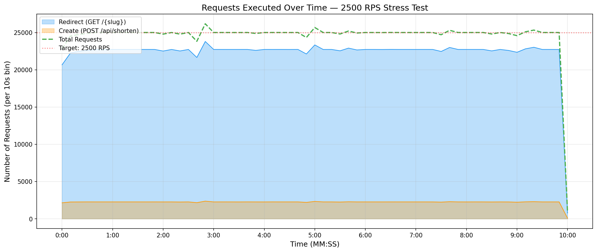
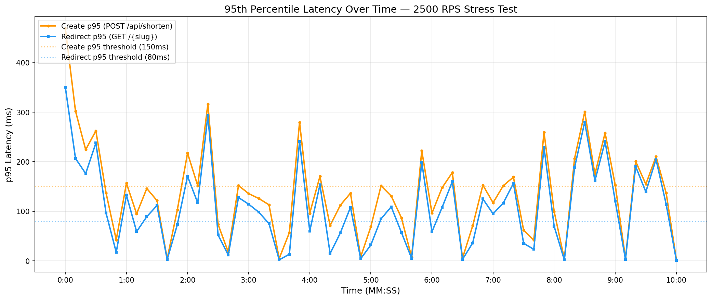

# Stress Test Report — 2500 RPS for 10 Minutes

**Date:** 2026-05-31 09:17
**Environment:** Local (SQLite, Release mode, single k6 instance)
**Test Script:** `tests/stress/stress-test-2500rps.js`
**Configuration:** Constant 2500 RPS for 10 minutes (1:10 create-to-redirect ratio)

---

## Test Parameters

| Parameter | Value |
|-----------|-------|
| Total Target RPS | 2,500 |
| Create RPS (POST /api/shorten) | ~227 |
| Redirect RPS (GET /{slug}) | ~2273 |
| Duration | 10 minutes |
| Seed Slugs | 1,000 |

---

## Summary

| Metric | Value |
|--------|-------|
| Total Requests | 1,496,827 |
| Test Duration | 600s (10.0 min) |
| Overall Throughput | 2494.7 RPS |
| Create Requests | 136,111 |
| Redirect Requests | 1,360,716 |

---

## Latency — Create (`POST /api/shorten`)

| Percentile | Latency |
|------------|---------|
| Median | 1.40 ms |
| p90 | 19.61 ms |
| **p95** | **151.30 ms** |
| p99 | 369.01 ms |
| Average | 19.44 ms |
| Max | 1164.48 ms |

---

## Latency — Redirect (`GET /{slug}`)

| Percentile | Latency |
|------------|---------|
| Median | 0.40 ms |
| p90 | 8.72 ms |
| **p95** | **106.01 ms** |
| p99 | 331.83 ms |
| Average | 14.71 ms |
| Max | 777.95 ms |

---

## Requests Over Time



This graph shows the number of requests executed in each 10-second time bin throughout the 10-minute test. The dashed green line represents total requests, while the blue and orange areas show redirect and create requests respectively. The red dotted line marks the 2500 RPS target.

---

## 95th Percentile Latency Over Time



This graph shows how the 95th percentile latency evolves over the duration of the test for both create (POST) and redirect (GET) requests. Dotted horizontal lines indicate the threshold targets. Sustained p95 values below the thresholds indicate stable performance at 2500 RPS.

---

## Threshold Results

| Threshold | Target | Result |
|-----------|--------|--------|
| Create p95 latency | < 150 ms | ❌ FAIL (151.30 ms) |
| Redirect p95 latency | < 80 ms | ❌ FAIL (106.01 ms) |
| Create p99 latency | < 200 ms | ❌ FAIL (369.01 ms) |
| Redirect p99 latency | < 100 ms | ❌ FAIL (331.83 ms) |

---

## How This Test Was Run

```bash
# 1. Start the service in Release mode
dotnet run --configuration Release --project src/TinyUrl.Api

# 2. Run the 2500 RPS stress test with CSV output
k6 run --out csv=results-2500rps.csv tests/stress/stress-test-2500rps.js

# 3. Generate this report
pip install pandas matplotlib
python tests/stress/generate-report-2500rps.py results-2500rps.csv
```
